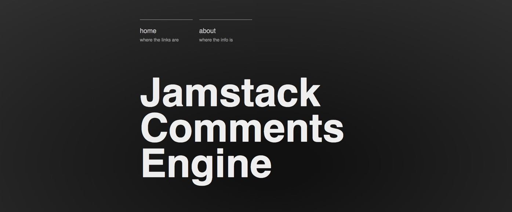

# Comments engine example.

Comments for your site. With no server to maintain and no Javascript dependency.

Built on Netlify

## Setting up

1. Clone the repo and deploy it as a netlify (with one click via this DTN button)

<!-- Markdown snippet -->

2. Configure a Slack integration on your Slack account
3. Add the required environment variables for:
  - API_AUTH
  - APPROVED_COMMENTS_FORM_ID
  - SLACK_WEBHOOK_URL
4. [Add build hook](https://app.netlify.com/sites/{SITE_NAME}/settings/deploys#build-hooks) which will rebuild and deploy the site whenever a new comment is submitted to the approved form
5. [Add a notification]() which will call our build hook (above) wheb a new comment is added to the approved comments form.
6. [Add a notification](https://app.netlify.com/sites/{SITE_NAME}/settings/forms#form-notifications) to call our comment handler [lambda]({ROOT-URL}/.netlify/functions/comment-handler) when a new comment is posted to the comments queue for approval.
